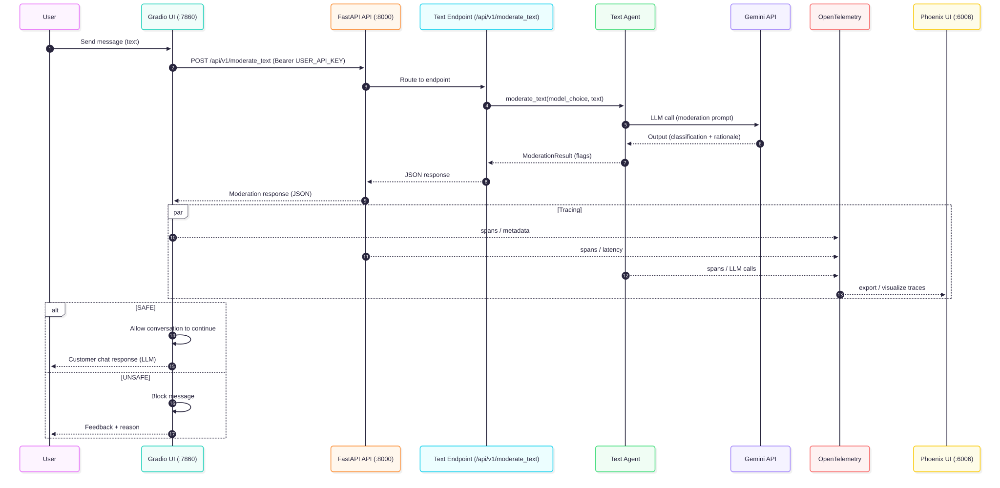

# Multimodal Moderation (ACME Enterprise)

An AI-powered **multimodal content moderation system with observability and analytics**
for customer service interactions (fictional company: **ACME Enterprise**).

The system moderates **text, images, audio, and video** *before* content is forwarded to customers,
detecting and flagging issues such as:
- **PII** (personally identifiable information)
- **Unprofessional or unfriendly tone**
- **Hate speech, spam, and misinformation**
- **Disturbing content**
- **Low-quality media** (blurry, pixelated, underexposed, etc.)

Beyond content blocking, the system provides **structured moderation results with detailed rationales**,
enabling analysis, observability, and auditing of moderation behavior.

The project simulates a real-world **customer service training scenario**:
a trainee support agent interacts with a **simulated customer powered by an LLM**.  
The customer has purchased an ACME product (*ACME Power Widget Pro*) that stopped working,
and every message or media sent by the trainee agent is automatically moderated
to ensure compliance with company standards.

The project includes:
- A **Gradio Chat UI** for interactive training (agent ↔ simulated customer)
- A **FastAPI backend** exposing programmatic moderation endpoints
- **Observability via Arize Phoenix** (traces, spans, metadata)
- A built-in **analytics layer** with aggregated moderation metrics and a visual dashboard

---

## Project Structure

```
/
├── docs/
├── evals/
├── multimodal_moderation/
│   ├── agents/
│   ├── api/
│   │   └── v1/
│   │       └── endpoints/
│   ├── types/
│   ├── app.py
│   ├── configs.py
│   ├── fastapi_app.py
│   ├── gradio_app.py
│   ├── observability.py
│   └── utils.py
├── tests/
├── .dockerignore
├── .gitignore
├── docker-compose.yml
├── Dockerfile
├── env.example
├── pyproject.toml
└── README.md
```

---

## Quick Links

- **Chat UI (Gradio):** http://localhost:7860  
- **API Docs (FastAPI Swagger):** http://localhost:8000/docs  
- **Phoenix (Tracing UI):** http://localhost:6006/projects  

---

## System Overview

[](docs/system-overview.svg)

---

## Moderation Pipeline (Internal)

<details>
<summary>Click to expand</summary>

[](docs/pipeline-internal.svg)

</details>

---

## Requirements

You can run the project in two ways:

### Option A — Local (Terminal)

* Python **3.12+**
* `uv`

### Option B — Docker (recommended for a “system-like” setup)

* Docker + Docker Compose

---

## Configuration

Create a `.env` file from `env.example` and set:

* `GEMINI_API_KEY` (required)
* `USER_API_KEY` (required – any string; used as a simple Bearer token for API authentication)
* `DEFAULT_GOOGLE_MODEL` (optional – default: `gemini-2.5-flash-lite`)
* `EVAL_JUDGE_MODEL` (optional – default: `gemini-2.5-flash-lite`)
* `EVAL_NUM_REPEATS` (optional – default: `5`)

### Linux/macOS

```bash
cp env.example .env
```

### Windows (PowerShell)

```powershell
Copy-Item env.example .env
```

---

# Run the Project

## Option A) Run locally via terminal (uv)

From the root directory:

1. Install dependencies

```bash
uv sync --dev
```

2. Install the package in editable mode

```bash
uv pip install -e .
```

3. Start the full stack (Chat UI + API + Phoenix)

```bash
uv run multimodal-moderation
```

Services:

* Chat UI (Gradio): [http://localhost:7860](http://localhost:7860)
* API (FastAPI): [http://localhost:8000](http://localhost:8000)
* Phoenix (Tracing): [http://localhost:6006](http://localhost:6006)

---

## Option B) Run with Docker + docker-compose

This mode runs **three containers**: `phoenix`, `api`, and `chat`.

### Prerequisites

Make sure the following files exist in the root of `/`:

* `Dockerfile`
* `docker-compose.yml`
* `.dockerignore`
* `.env`

### Start everything

```bash
docker compose up --build
```

### Stop everything

```bash
docker compose down
```

### View logs

```bash
docker compose logs -f
docker compose logs -f api
docker compose logs -f chat
docker compose logs -f phoenix
```

---

## Using the Application

## Moderation Analytics & Dashboard

The project includes a **built-in analytics layer** that aggregates moderation results and exposes them through both **API endpoints** and a **visual dashboard**.

This allows you to monitor:

* How much content is being moderated
* How often content is flagged as unsafe
* Which moderation flags are most frequently triggered
* The distribution of content types (text, image, audio, video)

### Analytics Architecture

* **In-memory event store** (`InMemoryModerationStore`)

  * Stores recent moderation events
  * Aggregates counts by flag, decision, and content type
  * Designed for demo and training purposes

* **FastAPI Analytics Endpoints**

  * Provide aggregated metrics and recent events
  * Used by the dashboard and available programmatically

* **Gradio Analytics Dashboard**

  * Visualizes metrics with charts and tables
  * Shares the same UI as the Chat interface (separate tab)

> ⚠️ Note: Analytics are stored in memory. Restarting the API resets the metrics.

---

### Analytics API Endpoints

The following endpoints are available in the FastAPI backend:

* **Summary metrics**

  ```
  GET /api/v1/analytics/summary
  ```

  Returns:

  * total number of moderation events
  * safe vs unsafe counts
  * safe rate
  * counts per content type
  * counts per triggered flag

* **Recent events**

  ```
  GET /api/v1/analytics/recent?limit=50
  ```

  Returns:

  * the most recent moderation events
  * timestamps, content type, decision, flags, model metadata

Authentication:

* Requires `Authorization: Bearer <USER_API_KEY>`

You can explore these endpoints directly via:

* **Swagger UI:** [http://localhost:8000/docs](http://localhost:8000/docs)

---

### Analytics Dashboard (Gradio)

The Gradio UI includes a dedicated **📊 Analytics** tab with:

* **KPIs**

  * Total moderation events
  * Safe rate
  * Safe vs unsafe counts

* **Charts**

  * Triggered flags (bar chart)
  * Events by content type
  * Safe vs unsafe distribution (pie chart)

* **Table**

  * Recent moderation events with flattened flag columns

To access it:

1. Start the application
2. Open the Chat UI: [http://localhost:7860](http://localhost:7860)
3. Navigate to the **📊 Analytics** tab
4. Click **Refresh** to load the latest metrics

---

## Moderation Aplication

### 1) Chat UI (Gradio)

Open: [http://localhost:7860](http://localhost:7860)
Chat with the simulated customer and upload media. All content is checked before being forwarded.

### 2) Traces (Phoenix)

Open: [http://localhost:6006/projects](http://localhost:6006/projects)
Inspect:

* spans per moderation step
* metadata and inputs/outputs
* latency and error patterns

### 3) Backend API (FastAPI)

Open: [http://localhost:8000/docs](http://localhost:8000/docs)

Authentication:

* Click **Authorize**
* Use `Bearer <USER_API_KEY>`

Typical endpoints:

* `POST /api/v1/moderate_text`
* `POST /api/v1/moderate_image_file`
* `POST /api/v1/moderate_audio_file`
* `POST /api/v1/moderate_video_file`
* `GET /api/v1/health`

> Tip: always confirm the exact paths in `/docs`.

---

## Request Flow (Text Moderation)

[](docs/text-moderation.svg)

---

## Running Evaluations (Evals)

From the project root (`/`):

```bash
uv run evals/text/test_cases.py
uv run evals/image/test_cases.py
uv run evals/audio/test_cases.py
uv run evals/video/test_cases.py
```

Notes:

* Scores may vary (LLMs are not deterministic).
* If you want more stable results, run the suite multiple times and compare averages.

---

## Troubleshooting

### 401 — Invalid user API key

* Ensure `.env` contains `USER_API_KEY`
* Ensure requests include `Authorization: Bearer <USER_API_KEY>`

### 404 — Not Found on `/api/v1/...`

* Confirm the real route paths in [http://localhost:8000/docs](http://localhost:8000/docs)
* Ensure the API is running (port `8000`)

### Connection refused to `localhost:8000`

* The API process/container is not running or crashed.
* Check logs:

  * Local: terminal output
  * Docker: `docker compose logs -f api`

### Phoenix UI loads but no traces appear

* Confirm `PHOENIX_URL` is set correctly:

  * Local: `http://localhost:6006`
  * Docker: `http://phoenix:6006` (inside compose)


## License

This project is provided for educational purposes. Add a license file if you plan to distribute it publicly.